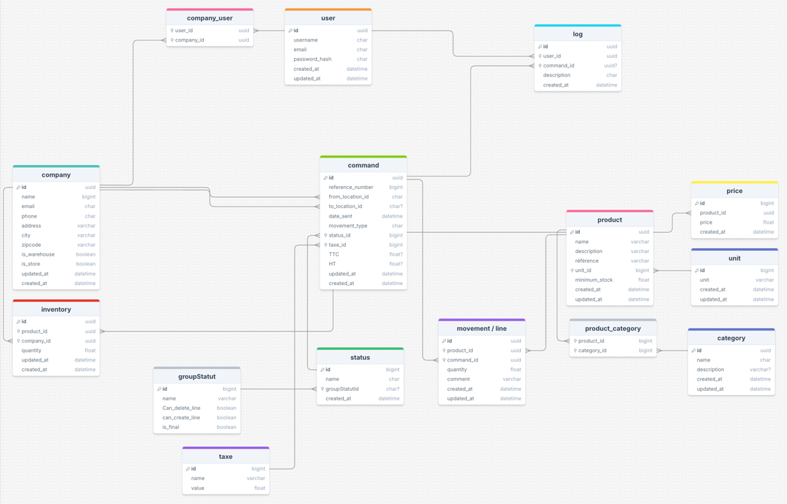

# Projet StockFast

## Introduction

Création d'un application web pour gérer les stocks de produits.

- gestion des utilisateurs
- gestion des produits
- gestion des quantités par entrepôt
- gestion des alertes
- gestion des données


## Installation

```bash
# cloner le projet
git clone https://github.com/math-dev-24/stock-django
cd stock-django

# créer un virtualenv
virtualenv venv
source venv/bin/activate

# installer les dépendances
pip install -r requirements.txt

# créer la base de données
python manage.py makemigrations stock
python manage.py migrate

# Chargement des fixtures
python manage.py loaddata categories.json
python manage.py loaddata companies.json
python manage.py loaddata products.json
python manage.py loaddata prices.json
```

# Fonctionnalités
1. Catalogue produits
Création, consultation, modification et suppression des fiches produits (EAN ou identifiant unique (SKU), libellé, description, prix de référence, seuil d'alerte).

2. Multi-entrepôts / boutiques
Possibilité d'enregistrer plusieurs points de vente ou dépôts et de suivre les quantités disponibles par site.

3. Mouvements de stock
Entrées, sorties, historisation avec horodatage.

4. Alertes seuil critique
Génération d'un rapport au format JSON contenant les produits en rupture de stock.

5. Affichage des données
Affichage des données de façon lisible et agréable pour l'utilisateur avec la librairie Rich.

# Base de données


# Développement / TODO

- [x] Mise en place de tailwindcss
- [x] Mise en place de la gestion des utilisateurs
- [x] Mise en place des pages de connexion et d'inscription
- [x] Mise en place du dashboard
- [ ] Produits
  - [x] Création
  - [ ] Modification
  - [x] Suppression
- [ ] Catégories
 - [x] Création
 - [ ] Modification
 - [ ] Suppression
- [ ] Entreprises
 - [ ] Création
 - [ ] Modification
 - [ ] Suppression

# Design system 
@TODO

Buttons :
- Primary
- Secondary
- orange